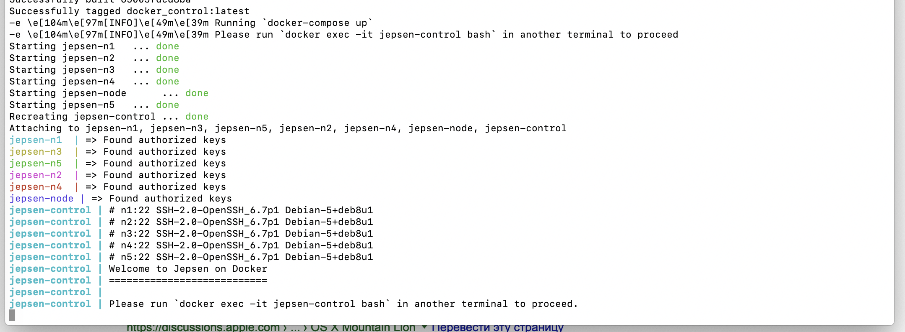
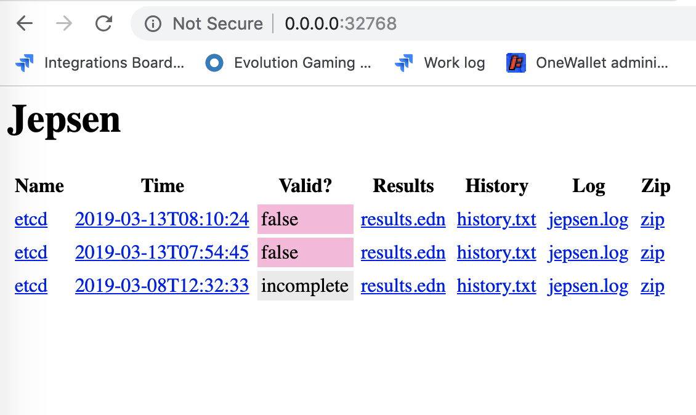
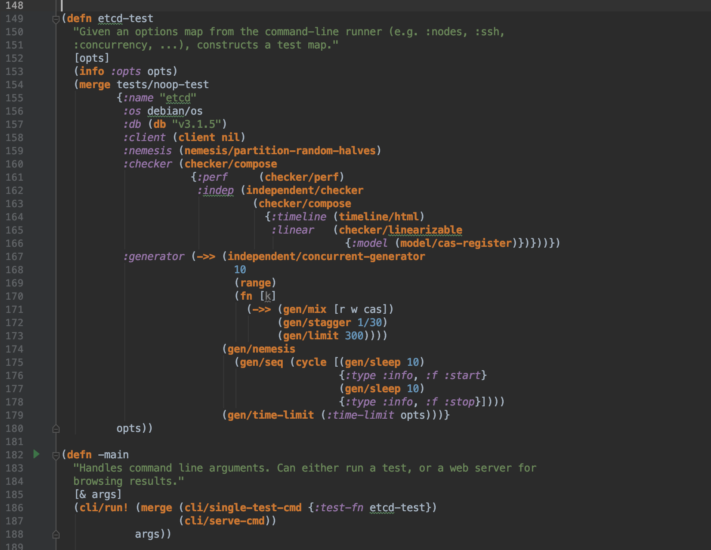

# Jepsen

## Super quick start

  - step 1: go to [jepsen github](https://github.com/jepsen-io/jepsen) and check readme
  - step 2: checkout project. Dependencies could be outdated, don't waste your time to correct it
  - step 3: go to /docker folder and run `up.sh` as described in folder's readme
  in the end you should see something like this: 
  - step 4: run `docker ps` to check the containers
  - step 5: run test for etcd (quite easy just read the console hints). It will run test against etcd and then
  check the results log to verify if it corresponds expected conditions. Yes, it means that you could not reproduce 
  exactly the same test twice
  - step 6: run `lein run serve` and check docker_control node port for web interface to examine output
  
  - step 7: if you wandering about errors you could read this [article](https://aphyr.com/posts/316-call-me-maybe-etcd-and-consul) 
  
  Congrats! You are done with your first Jepsen test!
  
  
## How to write the test:

As simple as:

It is worth to study jepsen/etcd.clj for more understanding

- first of all you need to define main function that wraps jepsen cli
- in this case it use single-test-cmd and serve-cmd (enable results web server)
- noop-test - is test stub
- [r, w, cas] - means read, write and [compare and swap](https://en.wikipedia.org/wiki/Compare-and-swap) scenarios

## Notes:

- It's better to have cluster in ready to serve state 
I spend huge amount of time by checking half-working vagrant based solutions without success on Mac
- It should be possible to use java driver without clojure wrapper. But should be verified
- It could be useful to check this [repo](https://github.com/riptano/jepsen)
- Tutorial on jepsen [github](https://github.com/jepsen-io/jepsen/blob/master/doc/tutorial/index.md)
 is not beginner friendly step by step guide, more like some milestones, you'll need to figured out how to achieve
- Clojure tutorial that I used: https://clojurecourse.by/ (RUS)  
- I use [cursive plugin](https://cursive-ide.com/userguide/) for IntelliJ (30 day free trial) 

## Possible future steps:

- Setup cluster
- Write simple test using java? driver
- Define test set. Try to implement using clojure or clojure wrapper
 